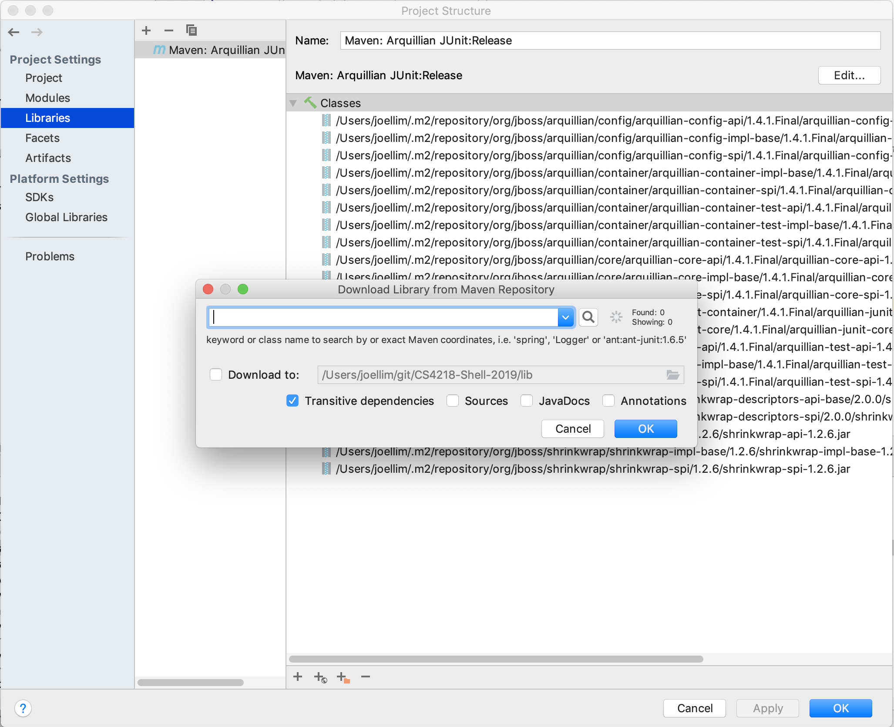
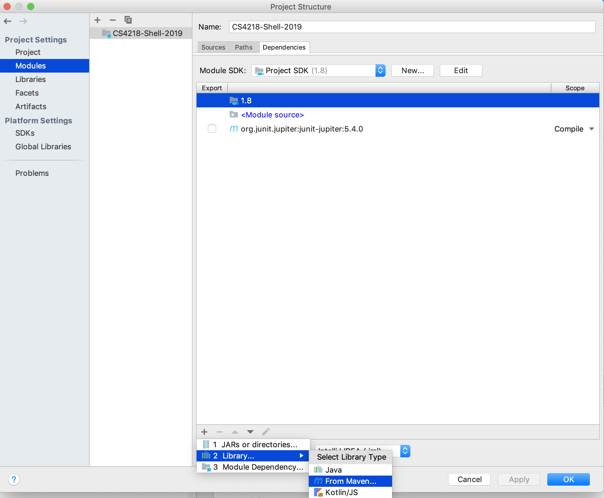
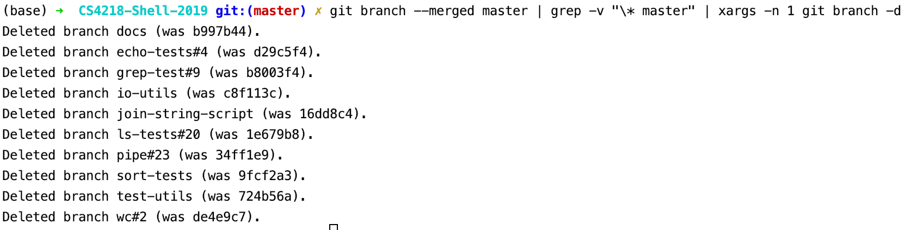

# IDE - Intellij

[Intellij](https://plugins.jetbrains.com/) is used.

## Java

(JDK 11)[https://www.oracle.com/technetwork/java/javase/downloads/jdk11-downloads-5066655.html]

## Maven

Download and install maven plugin
- [plugin](https://plugins.jetbrains.com/plugin/1166-maven-2-integration).

### Installing libraries

Go to `Module Settings` ->  `Project Structure` -> `+` -> `Maven`

### Add library

Example List
- org.jboss.arquillian.junit:arquillian-junit-container:1.4.1.Final

# .gitignore

Notes and references for decisions regarding ignoring files

1. intellij boilerplate
	- (github/gitignore)[https://github.com/github/gitignore/blob/master/Global/JetBrains.gitignore]
2. .idea/misc.xml is ignored
	- (ignoring .idea/misc.xml)[https://github.com/joeblau/gitignore.io/issues/215]

## Miscellenous utils/scripts/commands

### Remove merged git branches

`git branch --merged master | grep -v "\* master" | xargs -n 1 git branch -d`

[https://stevenharman.net/git-clean-delete-already-merged-branches](Reference)
